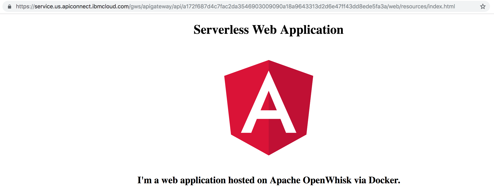

# Web Application Resources hosted on OpenWhisk

This project contains an [Apache OpenWhisk](https://openwhisk.apache.org/) function to host static resources of web applications. 

The tutorial [Serverless Web Application and API](https://console.bluemix.net/docs/tutorials/serverless-api-webapp.html) describes how to develop serverless APIs and web applications. With the code from this project even the web resources can be hosted on OpenWhisk (rather than GitHub Pages).

The project contains a sample Angular application, but the same mechanism works for other client-side web frameworks like React and Vue.js. Simply replace the files in the [docker/resources](docker/resources) directory.

The function has been implemented as Docker image so that web resouces can be handled which are [bigger than 48 MB](https://console.bluemix.net/docs/openwhisk/openwhisk_reference.html#openwhisk_syslimits_codesize).

The web application will be accessible via URLs like this one: https://service.us.apiconnect.ibmcloud.com/gws/apigateway/api/xxx/web/resources/index.html. In order to use a custom domain, you can use [IBM API Connect](https://www.ibm.com/support/knowledgecenter/en/SSMNED_5.0.0/com.ibm.apic.apionprem.doc/create_env_506.html) instead of the API Management functionality integrated in IBM Cloud Functions.

Here is a screenshot:



## Setup

**Prerequisites**

Make sure you have the following tools installed:

* [Node](https://nodejs.org/en/download/)
* [Docker](https://docs.docker.com/engine/installation/)
* [git](https://git-scm.com/downloads)
* [IBM Cloud account](https://ibm.biz/nheidloff)
* [ibmcloud CLI](https://console.bluemix.net/docs/cli/index.html)

**Installation**

```sh
$ git clone https://github.com/nheidloff/openwhisk-web-app-resources.git
$ cd openwhisk-web-app-resources
$ npm install
$ cd docker
$ docker build -t nheidloff/openwhisk-web-app:1 .
$ docker push nheidloff/openwhisk-web-app:1
$ ibmcloud login
$ ibmcloud fn action create openwhisk-web-app --docker nheidloff/openwhisk-web-app:1 --web true
$ ibmcloud fn api create -n "angular-web-app" /web /resources get openwhisk-web-app --response-type http
```

Open the following URL in your browser: https://service.us.apiconnect.ibmcloud.com/gws/apigateway/api/xxx/web/resources/index.html

**Customization of the Angular App**

In order to update the Docker image with a changed Angular app, run these commands:

```sh
$ cd angular
$ ng build --prod
$ cd ../docker
$ docker build -t nheidloff/openwhisk-web-app:2 .
$ docker push nheidloff/openwhisk-web-app:2
$ ibmcloud fn action update openwhisk-web-app --docker nheidloff/openwhisk-web-app:2 --web true
```
